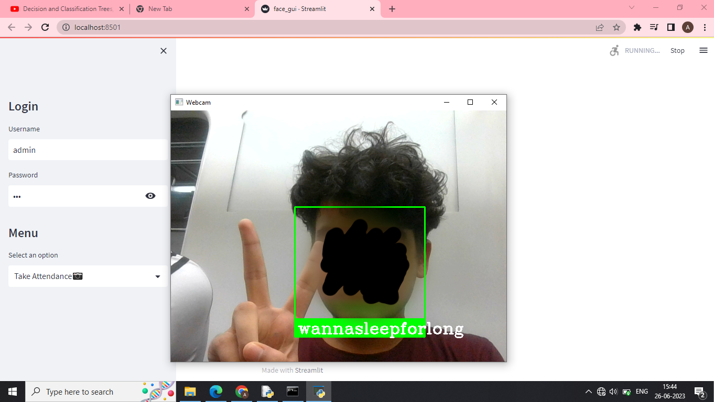

# Face-Detection-Attendance-System-Deployed
Face attendance system with the functions of login and taking, reading and compiling attendance deployed using streamlit.

This has been made with the use of face-recognition module.

After installling the necessary modules and following the steps in 'instructions.txt', open cmd on the destination folder of the main python files and run `streamlit run face_gui.py`

The username is wannasleepforlong and the password is uwu but you can change that however you want.

That's all!

Peace out (°꒳°)

Output Example

